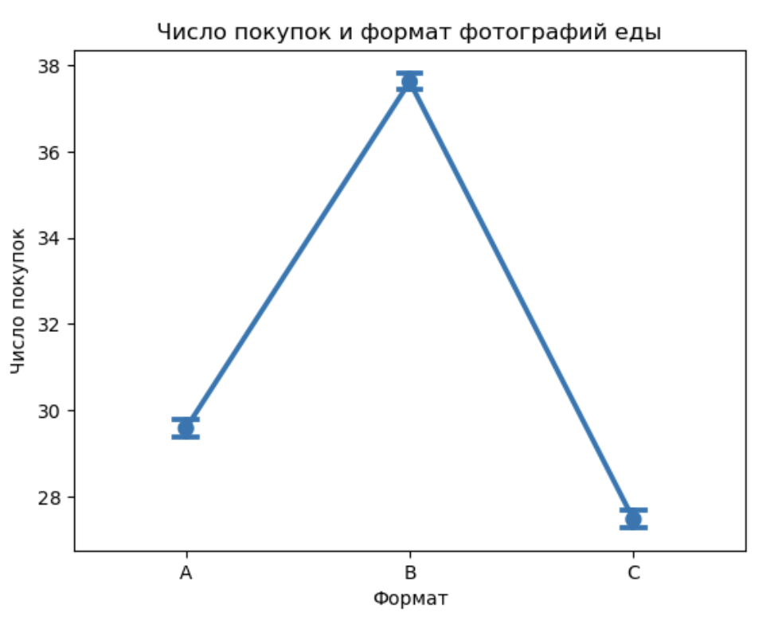
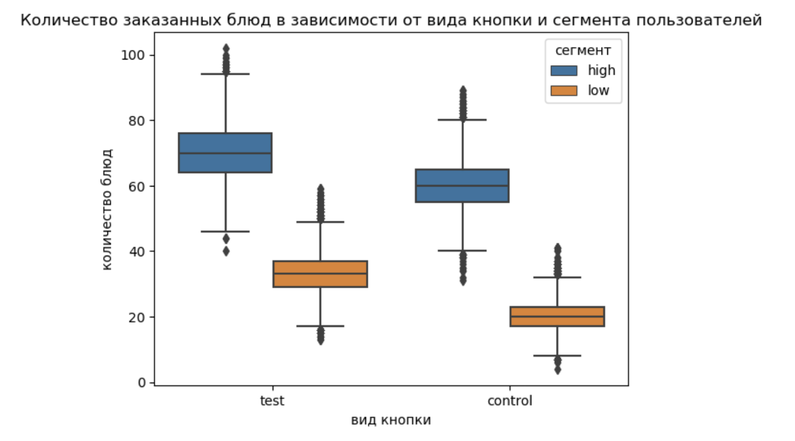

# A/B-тестирование: приложение по доставке еды

## Описание проекта

Цель проекта — проанализировать результаты двух A/B тестов в приложении по доставке готовых блюд:

1. **Формат фотографий блюд**: пользователи видели изображения в разных форматах (A — прямоугольные 16:9, B — квадратные, C — прямоугольные 12:4)
2. **Новая кнопка оформления заказа**: изменён внешний вид кнопки, тестирование проводилось на двух сегментах пользователей (high/low)

Проект выполнен в рамках курса по статистике и демонстрирует умения в работе с гипотезами, визуализациями и статистическими тестами.

---

## Используемые методы

- Проверка на нормальность (`pg.normality`, Shapiro-Wilk)
- Проверка гомогенности дисперсий (`pg.homoscedasticity`, Levene’s test)
- Однофакторный и многофакторный дисперсионный анализ (ANOVA)
- Пост-хок анализ (Tukey HSD)
- Визуализация: `violinplot`, `histplot`, `pointplot`, `boxplot`
- Группировка по сегментам, анализ взаимодействий

---

## Примеры визуализаций

### Влияние формата фотографий блюд на число заказов

🔍 Квадратные изображения (группа **B**) демонстрируют наибольшее среднее количество заказов.  
Различия между форматами статистически подтверждены (ANOVA + критерий Тьюки).

---

### Влияние новой кнопки оформления заказа в разных сегментах

💡 Новая кнопка (группа **test**) даёт прирост заказов в обоих сегментах, особенно выраженный в сегменте **high**.  
В модели значимыми оказались оба фактора (`group`, `segment`) и их взаимодействие.

---

## Структура проекта

| Файл | Содержание |
|------|------------|
| `ab_test_food_delivery.ipynb` | Основной ноутбук с анализом и визуализациями |
| `5_task_1.csv` | Результаты теста с изображениями блюд |
| `5_task_2.csv` | Результаты теста с новой кнопкой оформления заказа |
| `img/` | Визуализации для README |

---

## Основные выводы

- Квадратные изображения (группа **B**) **значимо увеличивают** количество заказов.
- Все факторы (**group**, **segment**) и их взаимодействие оказались статистически значимыми (`p < 0.05`).
- Среднее количество заказов увеличилось при использовании нового варианта кнопки.
- Предложенные изменения могут положительно повлиять на поведение пользователей и улучшить бизнес-показатели.

---

## Навыки и инструменты

- Анализ A/B тестов
- Статистические тесты: нормальность, ANOVA, post-hoc
- Визуализация и интерпретация данных
- Python: `pandas`, `seaborn`, `matplotlib`, `pingouin`
- Принятие решений на основе данных
